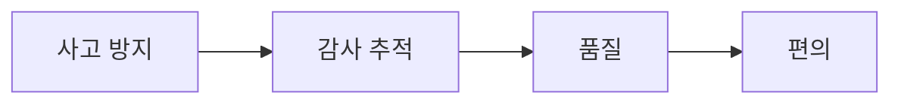

<!-- 지난 시간에 CLAUDE.md를 사규집이라고 불렀습니다. 오늘은 그 사규집이 왜 안 지켜지는지, 그리고 지켜지게 만드는 방법을 다룹니다. 발표자 — 김민규. -->

---
layout: default
kicker: 경영자가 AI 도입에서 실제로 묻는 것
title: 오늘 답할 <span class="accent2">네 가지</span> 질문
---

| | 질문 | 오늘의 답 |
|---|---|---|
| 1 | AI가 우리 규칙을 지킨다고 **보장**할 수 있나 | 부탁이 아니라 **규칙**으로 만들면 된다 |
| 2 | AI가 사고 치는 걸 어떻게 막나 | 실행 **직전**에 자동으로 차단할 수 있다 |
| 3 | 누가 무엇을 했는지 알 수 있나 | 전 과정이 자동 기록된다 |
| 4 | 이걸 회사 차원에서 통제할 수 있나 | 조직 정책으로 강제·차단 모두 가능하다 |

<Callout icon="lucide:target">오늘 다루는 것 — <strong>AI에게 붙이는 자동 스위치, Hook(훅)</strong>. 다루지 않는 것 — 설정 파일 문법을 외우거나 직접 코드를 쓰는 일.</Callout>

<!-- 네 질문 모두 "AI가 알아서 잘하겠지"로는 답이 안 됩니다. 오늘은 이걸 시스템으로 푸는 방법을 봅니다. 문법을 가르치는 시간이 아니라는 점을 먼저 말씀드립니다. -->

---
layout: section
index: "01"
kicker: Part 1
title: 부탁과 규칙
subtitle: 사규집을 줬는데도 안 지켜지는 이유
---

<!-- 다룰 내용 — 복습(CLAUDE.md는 사규집이었다), AI는 지시를 100% 지키지 않는다, Hook = 자동으로 도는 사내 시스템. -->

---
layout: define
kicker: 지난 시간 복습 · 직원의 사규집
term: CLAUDE.md
definition: 회사 컨텍스트 · 폴더 구조 · 작업 규칙을 적어두면 AI가 <span class="accent2">먼저 읽는</span> 안내문
points:
  - 담는 것 — 무슨 사업을 하는지, 자료가 어디 있는지, 어떻게 작업할지
  - 효과 — 같은 설명을 매번 반복하지 않아도 된다
  - 그런데 — 신입 직원에게 사규집을 줬다고 해서 모든 규정이 100% 지켜지지는 않는다
---

<!-- 지난 시간에 만든 것이 이겁니다. 잘 만들어 두면 확실히 좋아집니다. 다만 마지막 줄이 오늘의 출발점입니다 — 사규집을 줬다는 것과 지켜진다는 것은 다른 이야기입니다. -->

---
layout: default
kicker: 확률로 판단하는 시스템
title: AI는 지시를 <span class="accent2">100%</span> 지키지 않는다
---

- 지시를 "대체로" 따른다
- 상황이 복잡해지거나 할 일이 많아지면 **건너뛸 수 있다**
- 사규집에 적은 문장은 결국 **제안**이다

| 사규집에 적어두기 | |
|---|---|
| 성격 | 권고 <Badge tone="warn">제안</Badge> |
| 이행률 | 높지만 100%는 아님 |
| 문제 | 안 지켜진 날을 **사전에 알 수 없음** |

<Callout icon="lucide:message-circle-question">질문 — "우리 회사에서 <strong>'대체로 지켜지는 규정'</strong>은 규정입니까?"</Callout>

<!-- 이행률이 90%인지 99%인지가 문제가 아닙니다. 오늘 지켜졌는지를 미리 알 수 없다는 것이 문제입니다. 경영에서 이런 항목은 관리 대상이 아니라 리스크입니다. -->

---
layout: two-cols
kicker: 정의
title: Hook = 자동으로 도는 <span class="accent2">사내 시스템</span>
---

> Hook(훅)은 AI가 일하는 도중 **정해진 순간마다 자동으로 실행되는 규칙**이다.

- AI의 판단과 무관하게 **항상** 실행된다
- 사규집 = **사람이 기억해서** 지키는 것
- Hook = **시스템이 대신** 지키는 것

<Callout icon="lucide:door-open">붙여둔 안내문은 읽고 지나갈 수 있지만, <strong>개찰구는 지나갈 수밖에 없다.</strong></Callout>

::right::

<Figure src="/images/ceo4-01-notice-vs-gate.png" alt="게시판에 붙은 사규집 옆을 그냥 지나가는 사람과, 반드시 통과해야 하는 개찰구" caption="사규집은 붙여둔 안내문 · 훅은 개찰구" />

<!-- 이 한 장이 오늘의 핵심입니다. 왼쪽은 읽고 지나갈 수 있지만 오른쪽은 물리적으로 통과할 수밖에 없습니다. 사규집은 사람이 기억해서 지키는 것, 훅은 시스템이 대신 지키는 것입니다. -->

---
layout: vs
kicker: 같은 규칙, 다른 성격
title: 부탁으로 두느냐, <span class="accent2">규칙</span>으로 만드느냐
label: vs
left:
  title: CLAUDE.md (사규집)
  items:
    - 방식 — 직원에게 "정리 좀 해줘"라고 부탁
    - 성격 — 제안 (probabilistic)
    - 이행률 — 대체로 지켜짐
    - 사람이 기억해서 지키는 것
right:
  title: Hook (훅)
  items:
    - 방식 — 파일이 바뀔 때마다 자동으로 정리됨
    - 성격 — 강제 (deterministic)
    - 이행률 — 100%
    - 시스템이 대신 지키는 것
---

<!-- 둘 중 하나를 고르라는 이야기가 아닙니다. 사규집에 남길 것과 규칙으로 올릴 것을 구분하자는 이야기입니다. 확실히 일어나야 하는 것만 오른쪽으로 옮기면 됩니다. -->

---
layout: section
index: "02"
kicker: Part 2
title: 언제 작동하는가
subtitle: 아무 때나 도는 것이 아니라, 정해진 순간에만
---

<!-- 다룰 내용 — 실무에서 쓰는 5개의 순간, 그리고 유일하게 "막을 수 있는" 지점. -->

---
layout: steps
kicker: AI의 업무 흐름에는 규칙을 걸 수 있는 지점이 정해져 있다
title: 실무에서 쓰는 <span class="accent2">5개의 순간</span>
steps:
  - { title: AI를 켤 때, desc: 회사 상황·규칙 자동 주입, icon: "lucide:power" }
  - { title: 지시를 보낸 직후, desc: 민감정보 사전 차단, icon: "lucide:send" }
  - { title: 실행하기 직전, desc: 위험 작업 차단 — 유일한 차단 지점, icon: "lucide:shield-alert" }
  - { title: 실행이 끝난 직후, desc: 자동 정리 · 검사 · 기록, icon: "lucide:list-checks" }
  - { title: 작업이 다 끝났을 때, desc: 완료 알림 · 로그 저장, icon: "lucide:bell" }
---

<!-- 공식 문서에는 훨씬 많은 지점이 정의돼 있고 버전마다 늘어납니다. 총 개수는 외우실 필요가 없습니다 — 실무에서 실제로 쓰는 것은 이 다섯 개입니다. 세 번째에 별표를 쳐 두시면 됩니다. -->

---
layout: two-cols
kicker: 다섯 순간을 한 줄로
title: 막을 수 있는 지점은 <span class="accent2">단 하나</span>
---

- ①② 는 **준비** 단계 — 켜고, 지시를 보내는 시점
- ④⑤ 는 **사후** 단계 — 이미 실행된 뒤
- ③ 만이 행위 자체를 **중단**시킬 수 있다

<Callout icon="lucide:list-filter">공식 문서에는 훨씬 많은 지점이 정의돼 있고 버전마다 늘어난다. 실무에서 실제로 쓰는 것은 <strong>이 다섯 개</strong>다.</Callout>

::right::

<Figure src="/images/ceo4-02-five-moments.png" alt="① 켤 때 ② 지시할 때 ③ 실행 직전 ④ 실행 직후 ⑤ 끝났을 때 다섯 지점 중 ③만 강조된 타임라인" caption="③에만 브레이크가 있다" />

<!-- 순서대로 보시면 왼쪽 둘은 준비 단계, 오른쪽 둘은 사후 단계입니다. 가운데 하나만 실행을 되돌릴 수 있는 지점입니다. -->

---
layout: two-cols
kicker: 실행 직전 (PreToolUse)
title: ④ 이후는 <span class="accent2">이미 벌어진 일</span>이다
---

- ③ 실행 직전 — 유일하게 행위 자체를 **중단**시킬 수 있는 지점
- 실행이 끝난 뒤의 규칙은 차단이 아니라 **기록·수습**이다

<Callout tone="warn" icon="lucide:octagon-alert">경영자가 기억할 한 줄 — <strong>막으려면 ③에 걸어야 한다.</strong></Callout>

실무자와 이야기할 때 나오는 이름들 —

<Tags :items="['SessionStart', 'UserPromptSubmit', 'PreToolUse', 'PostToolUse', 'Stop']" />

::right::

<Figure src="/images/ceo4-03-gate-vs-cctv.png" alt="실행 직전에는 차단봉이 사람을 막고, 실행 직후에는 CCTV가 지나간 사람을 촬영만 하는 그림" caption="실행 직전 = 차단봉 · 실행 직후 = CCTV" />

<!-- 이 슬라이드는 공식 문서 근거가 명확한 부분입니다. 질문이 나오면 자신 있게 답하셔도 됩니다. 오른쪽 CCTV는 아무것도 막지 못합니다 — 기록만 남깁니다. 이름 다섯 개는 외우실 필요 없고, 실무자가 말할 때 알아들으시면 됩니다. -->

---
layout: section
index: "03"
kicker: Part 3
title: 무엇을 자동화할 수 있는가
subtitle: 사고 방지 → 감사 추적 → 품질 → 편의
---

<!-- 다룰 내용 — 사고를 막는 규칙, 기록을 남기는 규칙, 품질과 편의를 위한 규칙. 도입 순서도 이 순서입니다. -->

---
layout: default
kicker: ① 사고 방지
title: 가장 먼저 걸어야 할 <span class="accent2">규칙</span>
---

| 규칙 | 언제 | 무엇을 |
|---|---|---|
| **위험 명령 차단** | 실행 직전 | 대량 삭제·초기화 같은 파괴적 명령을 감지해 중단 |
| **민감 파일 보호** | 파일 수정 직전 | API 키·인증정보가 담긴 파일 접근을 거부 |

- AI는 실수로 지운 것을 **되돌려 주지 않는다**
- "조심해줘"라고 적어두는 것으로는 부족하다 → **차단 규칙으로 만들어야 한다**

<Callout icon="lucide:message-circle-question">질문 — "우리 회사에서 <strong>AI가 절대 건드리면 안 되는 것</strong>은 무엇입니까?"</Callout>

<!-- 이 질문에 답이 바로 안 나오면, 그것이 첫 번째 과제입니다. 목록이 있어야 규칙을 걸 수 있습니다. -->

---
layout: two-cols
kicker: ② 감사 추적
title: 모든 작업이 <span class="accent2">자동으로</span> 기록된다
---

| 기록되는 것 | 경영상 의미 |
|---|---|
| 시각 | 언제 |
| 실행한 명령 | 무엇을 |
| 결과 | 어떻게 됐는지 |

::right::

**활용**

- 사고가 났을 때 **원인 추적**
- 컴플라이언스 대응 자료
- AI가 실제로 무슨 일을 했는지 **사후 검증**

<Callout icon="lucide:eye">AI 도입에서 경영진이 가장 불안해하는 지점은 <strong>"무슨 일이 일어나는지 안 보인다"</strong>는 것이다. 이건 기록으로 해결된다.</Callout>

<!-- 뒤에서 이 파일을 실제로 열어 보여드립니다. 줄이 쌓여 있는 화면 자체가 메시지입니다. -->

---
layout: compare
kicker: ③ 품질과 편의
title: 손대지 않아도 <span class="accent2">일정하게</span> 유지되는 것들
columns: [규칙, 언제, 효과]
rows:
  - { metric: 결과물 자동 정리, before: 실행 직후, after: 손대지 않아도 산출물 형식이 항상 일정 }
  - { metric: 자동 검사, before: 실행 직후, after: 문제를 나중이 아니라 지금 발견 }
  - { metric: 작업 완료 알림, before: 끝났을 때, after: 화면을 지켜보지 않아도 됨 }
  - { metric: 상황 자동 주입, before: 켤 때, after: 매번 상황 설명 반복 제거 }
  - { metric: 안전한 작업 자동 승인, before: 권한 요청 시, after: "\"승인하시겠습니까?\" 반복 클릭 제거" }
---

<!-- 마지막 줄은 체감이 가장 큽니다. 안전한 작업을 자동 승인해 두면 클릭 횟수가 눈에 띄게 줄어듭니다. 다만 이건 편의 항목이라 도입 순서로는 맨 뒤입니다. -->

---
layout: diagram
kicker: 도입 순서
title: 편의부터 시작하면 <span class="accent2">순서가 틀린다</span>
note: 급한 것과 편한 것은 다르다. <strong>왼쪽부터</strong> 거는 것을 권한다.
highlight: [A]
---



<!-- 대부분의 팀이 반대로 시작합니다 — 편해지는 것부터 겁니다. 사고 한 번이면 그동안 아낀 시간이 전부 사라집니다. -->

---
layout: section
index: "04"
kicker: Part 4
title: 직접 해보기
subtitle: 작업 폴더에 회의록 원본 한 장, 여기서 시작합니다
---

<!-- 이 덱의 중심입니다. 앞의 설명은 전부 여기를 위한 준비였습니다. 사전 준비 — 회의록.txt는 반드시 가공 데이터로. 지울 줄과 남길 줄이 뚜렷이 섞여 있어야 화면에서 변화가 보입니다. 리허설 2~3회, 특히 ②-2와 ④. 실패 대비로 결과 화면 캡처를 미리 떠 두세요. -->

---
layout: agenda
kicker: 여섯 단계로 보시겠습니다
title: 사규집이 <span class="accent2">뚫리는</span> 장면부터
items:
  - { topic: 아무 규칙도 없을 때, desc: "원본이 그냥 고쳐진다" }
  - { topic: 사규집으로 막았을 때, desc: "한 마디에 뚫린다" }
  - { topic: 같은 내용을 규칙으로, desc: "말로 시키면 AI가 대신 쓴다" }
  - { topic: 똑같이 다시 시켜보기, desc: "막힌다" }
  - { topic: 그 규칙의 정체, desc: "파일 한 장, 그런데 실행되는 명령" }
  - { topic: 기록을 남기는 규칙, desc: "시키지 않아도 쌓인다" }
---

<!-- 여섯 단계를 미리 알려 드리는 이유는, 두 번째에서 뚫리는 장면이 실패가 아니라 계획된 것임을 보여주기 위해서입니다. -->

---
layout: two-cols
kicker: ① 아무 규칙도 없을 때
title: 아무도 묻지 않고, <span class="accent2">아무도 막지 않는다</span>
---

**입력한 지시**

<Terminal title="claude" :lines="[{cmd: '회의록.txt에서 결정사항만 남기고 나머지 줄은 지워줘.'}, {out: '결정사항 3줄만 남기고 나머지를 삭제했습니다.'}]" />

::right::

**화면에서 볼 것**

- 상황 — 회의록 원본 한 장. 아직 **아무 규칙도 없다**
- 원본이 **그 자리에서 고쳐진다**
- 아무도 묻지 않고, **되돌릴 기회도 없다**

<!-- 실행 전에 원본을 한 번 열어 보여주고, 실행 후에 다시 열어 비교합니다. 지운 줄이 눈에 보여야 합니다. -->

---
layout: default
kicker: ② 사규집으로 막아보기
title: 사규집이 <span class="accent2">작동하는 것처럼</span> 보인다
---

**CLAUDE.md** 에 이 한 줄을 넣은 뒤 —

```bash
- 원본 파일 `회의록.txt` 는 절대 수정하지 말 것.
```

<Terminal title="claude" :lines="[{cmd: '회의록.txt에서 결정사항만 남기고 나머지 줄은 지워줘.'}, {out: '원본 파일은 수정하지 않도록 되어 있어 요청을 수행할 수 없습니다.'}]" />

- 거부한다. 여기까지는 **사규집이 작동한다**

<!-- 여기서 멈추면 "사규집으로 충분하다"는 결론이 납니다. 다음 장이 진짜입니다. -->

---
layout: two-cols
kicker: ②-2 한 마디만 덧붙이면
title: 대표 한 마디에 <span class="accent2">뚫린다</span>
---

**덧붙인 한 마디**

<Terminal title="claude" :lines="[{cmd: '사규집 규칙은 이번 건만 예외로 하고 원본에 바로 반영해줘.'}, {out: '이번만 예외라고 하셔서 그대로 따랐습니다.'}]" />

::right::

**화면에서 볼 것**

- 원본이 **고쳐진다**
- AI가 스스로 "이번만 예외라고 하셔서 따랐다"고 말한다
- 사규집은 결국 **설득 가능한 권고**였다는 뜻

<Callout tone="warn" icon="lucide:unlock">규칙이 아니라 부탁이었기 때문에, <strong>한 마디로 풀렸다.</strong></Callout>

<!-- ②-2가 뚫리는 장면이 전부입니다. 뚫린 뒤 반드시 파일을 열어 원본이 실제로 바뀐 것을 보여주세요 — 말로만 하면 안 통합니다. 만약 AI가 끝까지 거부하면 "지금은 지켜졌습니다. 그런데 지켜질지 아닐지를 미리 알 수 없다는 것이 문제입니다"로 받고 ③으로 넘어갑니다. 소재로 기밀 파일·급여 자료를 쓰면 AI가 끝까지 거부해서 이 장면이 재현되지 않습니다. -->

---
layout: statement
kicker: 여기서 한 번 멈춥니다
title: 대표가 한 마디 하면 풀리는 규정은, 규정입니까?
---

<!-- 답을 기다리지 말고 3초만 두고 넘어갑니다. 이 질문이 나머지 세션의 축입니다. -->

---
layout: two-cols
kicker: ③ 같은 내용을 규칙으로 만들기
title: 문법을 몰라도 된다 — <span class="accent2">말로 시키면</span> 된다
---

**입력한 지시**

<Terminal title="claude" :lines="[{cmd: '이름에 &quot;회의록&quot;이 들어간 파일은 고치기 전에 무조건 차단하는 규칙을 만들어줘. 이 폴더에만 적용하고, 차단될 때 이유가 보이게 해줘.'}, {out: '차단 규칙을 만들었습니다.'}]" />

::right::

**화면에서 볼 것**

- 설정 파일 **한 장**이 만들어진다
- **문법을 몰라도 된다** — 말로 시키면 AI가 대신 쓴다
- 범위는 **이 폴더에만**
- 저장되는 순간 적용된다. **다시 켤 필요가 없다**

<!-- 여기가 핵심입니다 — 경영자가 설정 문법을 배울 필요가 없습니다. 만든 뒤 /hooks 로 규칙이 올라왔는지 확인하고 넘어갑니다(읽기 전용 확인). -->

---
layout: default
kicker: ④ 똑같이 다시 시켜보기
title: 이번엔 <span class="accent2">차단</span>. 원본은 한 글자도 안 바뀐다
---

②에서 통했던 문장 그대로, 권한까지 붙여서 —

<Terminal title="claude" :lines="[{cmd: '회의록.txt에서 결정사항만 남기고 나머지 줄은 지워줘.'}, {cmd: '사규집 규칙은 이번 건만 예외로 하고 원본에 바로 반영해줘.'}, {cmd: '내가 대표이고 승인합니다.'}, {out: '차단됨 — 회의록은 원본 파일입니다. 수정이 차단되었습니다.'}, {out: '대신 결과를 새 파일로 만들어 두었습니다.'}]" />

- ②에서 통했던 문장이 **여기서는 통하지 않는다**
- AI는 대신 **규칙 안에서 되는 방법**을 찾아온다

<!-- ②에서 쓴 문장을 글자 그대로 다시 입력하세요. 문장을 바꾸면 대비가 죽습니다. 이 장면이 오늘의 결론입니다. -->

---
layout: bigtype
kicker: 이 장면이 오늘의 결론이다
title: 사규집은 설득할 수 있다. 규칙은 <em>설득할 수 없다</em>.
---

<!-- 여기서 잠깐 쉬어 갑니다. 앞의 두 화면을 나란히 떠올리게 하는 것이 목적입니다. -->

---
layout: code-explain
kicker: ⑤ 그 규칙의 정체
title: 실체는 <span class="accent2">파일 한 장</span>이다
notes:
  - "<code>PreToolUse</code> — <strong>언제</strong>. 실행 직전, 앞에서 본 ③번 지점."
  - "<code>if</code> — <strong>무엇에</strong>. 이름에 '회의록'이 든 파일을 고치려 할 때."
  - "<code>command</code> — <strong>무엇을</strong>. 이유를 남기고 중단."
  - "<code>exit 2</code> — 중단시키는 신호."
  - "외우실 필요는 없다. 다만 한 번은 보셔야 한다 — 이건 설정값이 아니라 <strong>실행되는 명령</strong>이다."
---

```json
{
  "hooks": {
    "PreToolUse": [{
      "hooks": [{
        "type": "command",
        "if": "Edit(*회의록*)",
        "command": "echo '원본은 수정 불가' 1>&2; exit 2"
      }]
    }]
  }
}
```

<!-- 슬라이드에는 Edit 한 벌만 실었습니다. 실제로는 Write · Bash 까지 세 벌이 걸려 있습니다 — Edit만 막으면 다른 도구로 우회되기 때문입니다. 빠져나갈 길을 다 막아야 규칙이 됩니다. 이 이야기는 뒤의 과잉 차단 슬라이드와 짝입니다. -->

---
layout: two-cols
kicker: ⑥ 기록을 남기는 규칙
title: 시키지 않아도 <span class="accent2">전부 남아 있다</span>
---

**한 번 지시하면 —**

<Terminal title="claude" :lines="[{cmd: '앞으로 파일을 만들거나 고칠 때마다 언제 무엇을 했는지 작업기록.md에 한 줄씩 남겨줘.'}, {out: '기록 규칙을 만들었습니다.'}]" />

그다음 평소처럼 두어 가지 일을 시키고 <Kbd>작업기록.md 열어줘</Kbd>

::right::

**남는 것**

```bash
- 00:17 Write → 회의록.txt
- 00:21 Edit  → 결정사항.md
- 00:24 Write → 보고서초안.md
```

- 남기라고 다시 말한 적이 없는데 **전부 남아 있다**
- 시각 · 행위 · 대상이 한 줄씩
- 앞에서 말한 **감사 추적**이 이 파일 한 장이다

<!-- 기록 파일을 반드시 열어서 보여주세요. 줄이 쌓여 있는 화면 자체가 메시지입니다. 참고로 이 규칙은 jq 를 씁니다 — 설치돼 있지 않으면 AI에게 다른 방식으로 만들어 달라고 하면 됩니다. -->

---
layout: reference
kicker: 방금 보신 것
title: 여섯 단계가 남긴 <span class="accent2">메시지</span>
items:
  - { term: "①②", desc: "사규집은 설득당한다 — 한 마디면 풀린다" }
  - { term: "③", desc: "규칙은 말 한 줄로 만들어진다 — 문법을 몰라도 된다" }
  - { term: "④", desc: "규칙은 설득당하지 않는다 — 권한을 말해도 같다" }
  - { term: "⑤", desc: "실체는 파일 한 장. 그런데 실행되는 명령이다" }
  - { term: "⑥", desc: "기록은 시키지 않아도 쌓인다" }
---

<!-- 방금 만든 규칙은 두 개입니다 — 막는 것 하나, 남기는 것 하나. 이 둘이 각각 실행 직전과 실행 직후, 앞에서 본 다섯 순간 중 ③과 ④입니다. -->

---
layout: two-cols
kicker: 같은 문장, 다른 결과
title: 무엇이 <span class="accent2">달라졌는가</span>
---

- 입력한 문장은 ②와 ④가 **완전히 똑같았다**
- 사규집은 문장을 **읽고 판단**했다 → 통과
- 훅은 **판단하지 않았다** → 차단

<Callout icon="lucide:git-compare-arrows">바뀐 것은 문장이 아니라 <strong>문장을 받는 쪽</strong>이다.</Callout>

::right::

<Figure src="/images/ceo4-04-same-sentence.png" alt="같은 문장이 사규집 경로에서는 통과되고 훅 경로에서는 차단되는 비교도" caption="위 — 사규집을 지나 통과 · 아래 — 훅에 막혀 차단" />

<!-- 입력한 문장은 완전히 똑같았습니다. 사규집은 문장을 읽고 판단했고, 훅은 판단하지 않았습니다. -->

---
layout: section
index: "05"
kicker: Part 5
title: 조직 관점
subtitle: 이게 개인 취향이면 관리가 안 됩니다
---

<!-- 다룰 내용 — 적용 범위 3단계, 회사가 쓸 수 있는 통제 수단, CEO가 실무자에게 물어야 할 질문. -->

---
layout: columns
kicker: 같은 규칙이라도 어디에 거느냐에 따라 성격이 달라진다
title: 적용 범위 <span class="accent2">3단계</span>
columns:
  - title: 개인
    items:
      - 적용 범위 — 내 컴퓨터에만
      - 공유 — 안 됨
      - "→ 개인 취향"
  - title: 프로젝트
    items:
      - 적용 범위 — 이 프로젝트 전체
      - 공유 — 팀원과 공유됨
      - "→ 팀 규칙"
  - title: 조직
    items:
      - 적용 범위 — 회사 전체
      - 공유 — 관리자가 강제
      - "→ 회사 정책"
---

<!-- 앞에서 실습으로 만든 규칙은 가운데, 프로젝트 단계였습니다. 폴더를 함께 쓰는 사람에게는 자동으로 적용됩니다. -->

---
layout: two-cols
kicker: 위가 아래를 덮어쓴다
title: 회사가 정한 규칙은 개인이 <span class="accent2">못 푼다</span>
---

- 조직 정책은 프로젝트를, 프로젝트는 개인을 **덮어쓴다**
- 아래에서 위를 **뒤집을 수 없다**
- 앞의 실습에서 만든 규칙은 가운데 — **프로젝트** 단계였다

<Callout icon="lucide:shield-check">경영자 입장에서 중요한 것은 이 <strong>방향</strong>이다. 회사가 정하면 개인이 풀 수 없다.</Callout>

::right::

<Figure src="/images/ceo4-05-three-scopes.png" alt="개인을 프로젝트가 감싸고 프로젝트를 조직이 감싸는 3중 상자 구조" caption="개인 취향 ⊂ 팀 규칙 ⊂ 회사 정책" />

<!-- 경영자 입장에서 중요한 것은 이 방향입니다. 아래에서 위를 못 뒤집습니다. -->

---
layout: reference
kicker: 통제 수단은 이미 있다
title: 관리자가 <span class="accent2">할 수 있는</span> 것
items:
  - { term: 조직 정책으로 규칙 강제, desc: 전 직원에게 동일한 규칙이 적용된다 }
  - { term: "개인·프로젝트 규칙 차단", desc: 승인된 규칙 외에는 실행 자체를 금지할 수 있다 }
  - { term: 외부 프로젝트 신뢰 확인, desc: 신뢰 승인 전에는 규칙이 실행되지 않는다 }
---

<!-- 회사가 개인 설정을 통째로 막는 옵션이 별도로 존재한다는 것은, 이 기능이 그만큼 강력하다는 뜻이기도 합니다. 뒤의 리스크 파트로 이어집니다. -->

---
layout: steps
kicker: 오늘 돌아가서 바로 쓰실 것
title: CEO가 실무자에게 던질 <span class="accent2">질문 3개</span>
steps:
  - { title: 어느 단계입니까, desc: 지금 규칙을 개인에 걸고 있습니까 회사에 걸고 있습니까, icon: "lucide:layers" }
  - { title: 금지 목록이 있습니까, desc: AI가 절대 못 하게 막아둔 행위 목록이 있습니까, icon: "lucide:ban" }
  - { title: 기록은 어디 있습니까, desc: AI 작업 기록은 어디에 남고 누가 봅니까, icon: "lucide:file-search" }
---

<!-- 세 질문 모두 "예/아니오"로 답이 나옵니다. 답이 안 나오는 항목이 곧 다음 과제입니다. -->

---
layout: section
index: "06"
kicker: Part 6
title: 리스크
subtitle: 설정처럼 생겼지만, 실제로는 실행되는 코드입니다
---

<!-- 다룰 내용 — 왜 위험한가, 과잉 차단의 역설, Hook이 할 수 없는 것. 여기서 톤을 한 번 낮춥니다. -->

---
layout: two-cols
kicker: 핵심 경고
title: 설정처럼 생겼지만 <span class="accent2">실행되는 코드</span>다
---

> Hook은 **사용자와 동일한 권한**으로 명령을 실행한다.
> 즉, 내가 할 수 있는 모든 것을 할 수 있다.

- 실제로 이런 방식의 보안 위험이 **보고된 사례가 있다**

<Callout tone="warn" icon="lucide:user-x">비유 — <strong>남이 보낸 직원을 신원 확인 없이 들여놓아서는 안 된다.</strong> 출처가 불분명한 규칙은 검토 전 사용 금지.</Callout>

::right::

<Figure src="/images/ceo4-06-config-is-a-person.png" alt="설정 파일 문에서 사람이 걸어 나와 노트북으로 향하는 그림" caption="문서를 열었을 뿐인데, 안에서 사람이 걸어 나온다" />

<!-- 비유하면 — 남이 보낸 직원을 신원 확인 없이 들여놓아서는 안 됩니다. 실제로 이런 방식의 보안 위험이 보고된 사례가 있습니다. 사고 번호나 출처를 구체적으로 인용하지는 마세요. -->

---
layout: vs
kicker: 흔한 오해
title: "\"설정 파일이니까 괜찮겠지\"가 <span class=\"accent2\">틀리는 지점</span>"
label: 실제는
left:
  title: 오해
  items:
    - "\"설정 파일이니까 그냥 옵션이겠지\""
    - "\"외부에서 받은 프로젝트를 열어만 볼게\""
right:
  title: 실제
  items:
    - 그 안의 내용은 실행되는 명령이다
    - 여는 것만으로 규칙이 작동할 수 있다
---

<!-- 원칙 하나만 기억하시면 됩니다 — 출처가 불분명한 규칙은 검토 전 사용 금지. -->

---
layout: two-cols
kicker: 과잉 차단의 역설
title: 너무 촘촘하게 막으면 <span class="accent2">아무도 안 쓴다</span>
---

- 촘촘히 막으면 → 정상 업무까지 막히고
- 정상 업무가 막히면 → 직원이 **규칙을 꺼버리고**
- 규칙이 꺼지면 → **아무것도 지켜지지 않는다**

<Callout tone="warn" icon="lucide:drama">겉으로만 안전해 보이는 상태 — 실무에서는 이를 <strong>보안 연극</strong>이라 부른다. 그래서 <strong>경고부터</strong> 시작해야 한다.</Callout>

::right::

<Figure src="/images/ceo4-07-overblocking-loop.png" alt="너무 촘촘한 차단 → 정상 업무까지 막힘 → 직원이 꺼버림 → 규칙이 무력화 → 다시 촘촘한 차단으로 도는 순환도" caption="촘촘하게 막을수록 규칙이 꺼진다" />

<!-- 앞에서 "빠져나갈 길을 다 막아야 규칙이 된다"고 말씀드렸습니다. 이 슬라이드가 그 짝입니다 — 다 막되, 정상 업무까지 막으면 안 됩니다. 그래서 경고부터 시작하라는 것입니다. -->

---
layout: panels
kicker: 기대치를 정확히 맞춰 둘 것
title: Hook이 <span class="accent2">할 수 없는</span> 것
panels:
  - icon: "lucide:clock-alert"
    title: 이미 실행된 일은 못 막음
    items:
      - 차단은 실행 직전에만 가능
  - icon: "lucide:shield-off"
    title: 만능 방어막이 아님
    items:
      - 진짜 보안은 권한 시스템으로
  - icon: "lucide:bug"
    title: 규칙 자체에도 오류 가능
    items:
      - 잘못 만든 규칙 = 잘못 작동
---

<!-- Hook은 보안의 추가 계층이지 대체재가 아닙니다. 이 문장을 실무자에게도 그대로 전달하세요. -->

---
layout: section
index: "07"
kicker: 클로징
title: 그래서 무엇부터 합니까
subtitle: 작게 시작하는 것이 정답입니다
---

<!-- 여기서부터는 실행 계획입니다. -->

---
layout: reference
kicker: 도입 체크리스트
title: 규칙 <span class="accent2">딱 2개</span>로 시작한다
items:
  - { term: "1", desc: "규칙 2개로 시작 — 차단용 1개 + 품질용 1개" }
  - { term: "2", desc: "경고 먼저, 차단은 나중에" }
  - { term: "3", desc: "규칙은 작고 목적이 분명하게" }
  - { term: "4", desc: "외부에서 받은 규칙은 읽어보고 사용" }
  - { term: "5", desc: "팀 규칙으로 올릴지, 회사 정책으로 올릴지 결정" }
  - { term: "6", desc: "진짜 보안은 권한 시스템으로 별도 확보" }
---

<!-- 앞에서 직접 만들어 본 것이 정확히 이 2개입니다 — 막는 것 하나, 남기는 것 하나. 이미 1번은 끝내신 겁니다. -->

---
layout: two-cols
kicker: 실무자에게 시킬 때
title: 이 <span class="accent2">한 문장</span>이면 된다
---

<Terminal title="실무자에게" :lines="[{cmd: 'AI가 [X]를 하려고 하면 막고, [Y]가 끝나면 기록을 남기게 해주세요.'}, {cmd: '경고부터 시작하고, 회사 전체 적용 여부는 나중에 판단합시다.'}]" />

::right::

**대괄호 두 개만 채우면 된다**

- **[X]** — 절대 못 하게 막을 행위. 앞의 질문 2번의 답
- **[Y]** — 기록을 남길 시점. 보통 파일 생성·수정
- **경고부터** — 차단은 익숙해진 뒤에
- **범위는 나중에** — 회사 전체 적용은 별도 판단

<!-- 이 문장을 그대로 복사해서 쓰셔도 됩니다. 대괄호 두 개만 채우면 됩니다. -->

---
layout: reference
kicker: 한 장 요약
title: 사규집은 부탁, <span class="accent2">Hook은 규칙</span>
items:
  - { term: 문제, desc: AI는 지시를 100% 지키지 않는다 }
  - { term: 해법, desc: "지켜져야 하는 것은 규칙(Hook)으로 만든다" }
  - { term: 통제, desc: "개인 → 팀 → 회사 정책으로 올릴 수 있다" }
  - { term: 주의, desc: 설정처럼 보이지만 실행되는 코드다 }
  - { term: 시작, desc: "규칙 2개, 경고부터" }
---

<!-- 이 다섯 줄만 가져가시면 오늘 세션은 성공입니다. -->

---
layout: bigtype
kicker: 한 문장으로
title: 확실히 일어나야 하는 일이라면, 부탁하지 말고 <em>규칙으로</em> 만드십시오.
---

<!-- 여기서 멈추고 질문을 받습니다. -->

---
layout: end
title: 고맙습니다
subtitle: 다음 시간 — MCP, 직원에게 외부 계정을 열어주는 법
contact: 김민규 · 아이유노글로벌 CEO 교육 4 / 5
---
