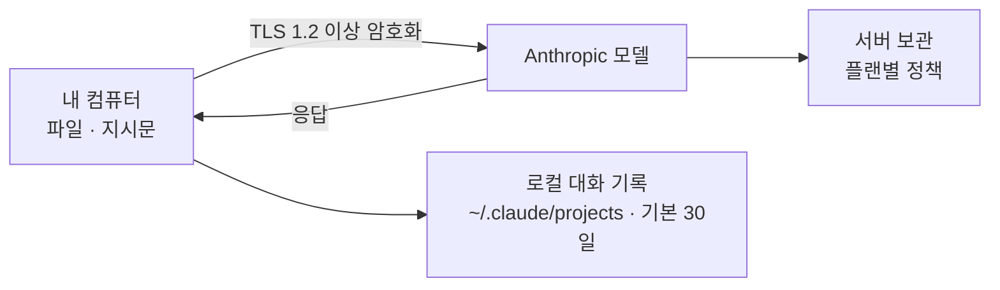
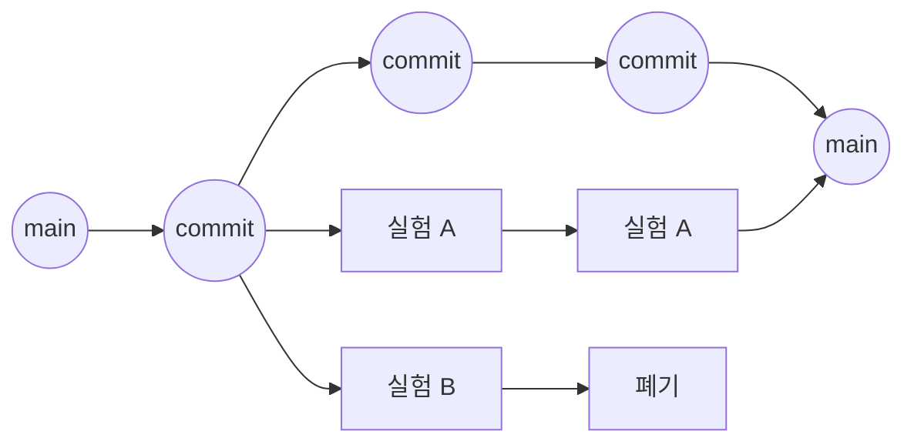

<!-- 3시간 단일 세션. 오늘 손에 남는 것은 앱이 아니라 내 데이터로 만든 대시보드 하나입니다. 발표자 — 김민규 -->

---
layout: vs
kicker: 지금 내 AI 사용은 어디인가
title: 같은 AI인데, <span class="accent2">역할</span>이 다르다
label: →
left:
  title: 도구 (Tool)
  items:
    - 결과물 — 화면 속 텍스트
    - 한 번의 대화로 끝난다
    - 내 역할 — 사용자
right:
  title: 직원 (Employee)
  items:
    - 결과물 — 실제 파일 · 실행되는 결과
    - 여러 단계를 알아서 진행한다
    - 내 역할 — 관리자
---

<!-- 대부분의 경영자는 아직 왼쪽 칸에 있습니다. 좋은 답을 받지만, 받은 답을 실행하는 건 여전히 사람입니다. 오른쪽 칸으로 넘어가면 바뀌는 것은 AI의 성능이 아니라 내 역할입니다. 오늘 다루는 것은 오른쪽 칸입니다. -->

---
layout: columns
kicker: Anthropic의 공식 구분
title: 다음에 무엇을 할지 <span class="accent2">누가</span> 정하는가
columns:
  - title: 증강된 LLM
    items:
      - 검색 · 도구 · 메모리가 붙은 LLM
      - 요청 하나에 응답 하나
      - "→ 사람이 결정"
  - title: 워크플로
    items:
      - LLM과 도구를 엮은 것
      - 진행 경로가 미리 정해져 있다
      - "→ 미리 정한 경로"
  - title: 에이전트
    items:
      - 진행 방식과 도구 사용을 스스로 결정
      - 목표만 주면 순서는 알아서
      - "→ LLM이 결정"
---

<!-- 세 번째가 오늘의 주제입니다. Claude Code가 실제로 하는 일이 그 정의의 실례입니다 — 파일을 읽고, 고칠 곳을 판단하고, 수정하고, 실행해 보고, 결과를 기록합니다. 이 순서를 제가 지시하지 않았다는 것이 핵심입니다. -->

---
layout: compare
kicker: 비개발자 경영자 앞에 놓인 선택지
title: 세 가지 길, 그리고 <span class="accent2">자릿수가 다른</span> 하나
columns: [구분, A. 코딩 학습, B. 개발자 고용, C. AI 개발자 채용]
rows:
  - { metric: 걸리는 시간, before: 6개월~1년, after: 채용에 수개월, delta: 오늘 }
  - { metric: 비용, before: 내 시간, after: 월 수백~수천만 원, delta: 월 $20~ }
  - { metric: 방향을 정하는 사람, before: 나, after: 협의, delta: 나 }
  - { metric: 한계, before: 본업이 멈춘다, after: 고정비 · 채용 리스크, delta: 지시 능력이 결과를 가른다 }
---

<!-- 대부분의 논의는 A와 B 사이에서만 이뤄져 왔습니다. C는 최근에야 선택지가 됐습니다. Pro는 월 $20, 더 많은 사용량이 필요하면 Max는 월 $100부터이고 Claude Code는 무료 플랜부터 포함됩니다. C의 비용은 A·B와 자릿수가 다릅니다 — 그래서 실패해도 되는 시도가 가능해집니다. 오늘 확인할 것은 "C가 가능한가"가 아니라 "C를 얼마나 잘 쓸 수 있는가"입니다. -->

---
layout: agenda
kicker: 앱이 아니라, 업무 산출물
title: 오늘 손에 남는 것 — <span class="accent2">대시보드 하나</span>
items:
  - { topic: 환경, desc: "Claude Code 설치 · 첫 업무 지시" }
  - { topic: 이해, desc: "직원의 작동 방식 · 비용 · 데이터 원칙" }
  - { topic: 능력, desc: "결과를 가르는 지시 방법" }
  - { topic: 산출물, desc: "내 데이터 → 웹 대시보드" }
  - { topic: 확장, desc: "저장소 · 외부 자원 연결" }
---

<!-- 코드를 배우지 않습니다. 코드를 지시합니다. 앱 출시나 서비스 개발이 목표가 아니라, 내일 업무에 쓸 수 있는 결과물이 목표입니다. -->

---
layout: section
index: "02"
kicker: Part 2
title: 설치 + 첫 지시
subtitle: 직원을 채용했으니, 출근시킬 차례입니다
---

<!-- 여기서부터는 실습입니다. 노트북을 열어주세요. -->

---
layout: compare
kicker: 준비물
title: 로그인할 <span class="accent2">계정 하나</span>
columns: [플랜, 비용, 오늘]
rows:
  - { metric: Free, before: "$0", after: 사용량 한도가 낮다 }
  - { metric: Pro, before: 월 $20 (연간 결제 $17), after: 최소 기준 }
  - { metric: Max, before: 월 $100부터, after: 권장 }
---

<!-- Claude Code는 무료 플랜부터 포함됩니다 — 별도 구매 항목이 아닙니다. 오늘은 API 키를 발급하지 않습니다. 카드 등록도 없습니다. 준비물은 하나, 로그인할 수 있는 계정입니다. 로그인은 브라우저에서 진행되니 아이디와 비밀번호를 확인해 두세요. -->

---
layout: columns
kicker: 터미널 — 컴퓨터에 글자로 지시하는 창
title: 검은 창을 <span class="accent2">여는 법</span>
columns:
  - title: 🍎 macOS
    items:
      - 응용 프로그램 → 유틸리티 → 터미널
      - 또는 Cmd + Space → "터미널" 입력
  - title: 🪟 Windows
    items:
      - 시작 메뉴 → PowerShell 입력 → 실행
---

<!-- 검은 창에 글자만 보이는 게 정상입니다. 앞으로의 모든 작업이 이 창에서 이뤄집니다. 마우스로 누를 버튼이 없다는 것이 낯설 뿐, 어려운 것은 아닙니다. 지금부터 나오는 명령은 입력한 뒤 Enter를 누릅니다. -->

---
layout: code-explain
kicker: 설치
title: 복사해서 붙여넣는 <span class="accent2">한 줄</span>
notes:
  - "<strong>🍎 macOS</strong> — 터미널에 그대로 붙여넣는다."
  - "<strong>🪟 Windows</strong> — PowerShell에 그대로 붙여넣는다."
  - "<strong>확인</strong> — 버전 번호가 나오면 성공. 문제가 있으면 <code>claude doctor</code>가 진단해 준다."
---

```bash
# 🍎 macOS
curl -fsSL https://claude.ai/install.sh | bash

# 🪟 Windows (PowerShell)
irm https://claude.ai/install.ps1 | iex

# 설치 확인
claude --version     # 버전 번호가 나오면 성공
claude doctor        # 설치 상태 상세 진단
```

<!-- 한 글자도 바꾸지 않고 복사해서 붙여넣습니다. -->

---
layout: two-cols
kicker: 첫 실행
title: <span class="accent2">claude</span> 한 단어로 출근시킨다
---

- 터미널에 <Kbd>claude</Kbd> 입력
- 브라우저가 자동으로 열린다
- 준비한 계정으로 로그인한다
- 터미널로 돌아오면 인증이 끝나 있다

<Callout icon="lucide:log-in">이 과정은 <strong>처음 한 번만</strong> — 다음부터는 <Kbd>claude</Kbd> 입력만으로 바로 시작된다.</Callout>

::right::

<Figure src="/images/s05-welcome.png" alt="Claude Code 시작 화면" caption="인증이 끝나면 이 화면에서 대기한다" />

<!-- 처음 실행하면 이 폴더를 신뢰하느냐고 한 번 더 묻습니다(Yes, I trust this folder). 이 시점부터 AI 개발자가 내 컴퓨터에서 대기 상태가 됩니다. -->

---
layout: reference
kicker: 문제 해결
title: 자주 만나는 <span class="accent2">네 가지</span>
items:
  - term: "command not found: claude"
    desc: 설치 직후 터미널이 새 경로를 모른다 → 터미널을 닫고 새로 연다
  - term: 🪟 설치했는데 인식이 안 됨
    desc: 시스템 환경 변수에 %USERPROFILE%\.local\bin 추가 → 터미널 재시작
  - term: 로그인 브라우저가 안 열림
    desc: 터미널에서 c 키로 주소 복사 → 브라우저에 붙여넣기
  - term: 🍎 권한 거부 · 확인되지 않은 개발자
    desc: 비공식 경로로 설치한 경우 → 공식 설치 명령을 쓰면 발생하지 않는다
---

<!-- 네 가지 중 첫 번째가 가장 흔합니다. 터미널 새로 열기로 대부분 해결됩니다. -->

---
layout: two-cols
kicker: 첫 업무 지시
title: 화면 속 답이 아니라 <span class="accent2">내 컴퓨터에 남는 결과물</span>
---

> 바탕화면에 **ai-작업** 폴더 만들고,
> 그 안에 인사말 파일 하나 만들어줘

- 폴더를 만들고, 파일을 만들고, 내용을 채운다
- 내가 시킨 것은 **목표 하나뿐** — 순서는 스스로 정했다
- 바탕화면을 보면 결과가 **실제로** 있다

::right::

<Figure src="/images/s09-done.png" alt="폴더와 파일 생성 완료 화면" caption="지시 한 줄 → 폴더 · 파일 · 내용까지 완료" />

<!-- 도구와 직원의 차이가 여기서 처음 드러납니다. 바탕화면을 직접 열어서 확인시켜 주세요. -->

---
layout: two-cols
kicker: 통제권
title: 작업 <span class="accent2">직전</span>에 멈추고 물어본다
---

- 폴더를 만들거나, 파일을 고치거나, 명령을 실행하기 **직전**에 승인을 요청한다
- 선택은 셋 — **Yes** / **Yes, and always allow…** / **No**
- 멈춘 것은 오류가 아니다. **기본 동작이다**

<Callout icon="lucide:shield-check">되돌리기보다 막는 것이 싸다. 그래서 실행 전에 묻는다 — <strong>직원은 제안하고, 결재는 내가 한다.</strong></Callout>

::right::

<Figure src="/images/s07-permission-bash.png" alt="승인을 묻는 화면" caption="실행 직전에 멈추고 결재를 요청한다" />

<!-- 경영자에게 이 화면은 통제권의 위치를 보여줍니다. 번호를 고르거나 Enter로 확정하고, Esc로 취소할 수 있습니다. -->

---
layout: section
index: "03"
kicker: Part 3
title: 직원의 작동 방식
subtitle: 채용했으면, 어떻게 일하는지 알아야 합니다
---

<!-- 다룰 내용 — 바이브 코딩, Claude Code라는 도구, 치트시트, CLAUDE.md = 사규집, 비용, 회사 데이터 원칙 -->

---
layout: define
kicker: 용어
term: 바이브 코딩 (Vibe Coding)
definition: 직관에 따라 큰 그림만 제시하고, 구체적인 코드는 <span class="accent2">AI가 작성</span>하는 방식
points:
  - 2025년 2월, Andrej Karpathy (전 OpenAI · Tesla AI)가 이름 붙였다
  - 핵심은 주도권이 사람에서 AI로 옮겨간 것이다
---

<!-- 용어 자체보다, 주도권이 어디로 갔는지가 중요합니다. -->

---
layout: vs
kicker: 비유
title: 만드는 비용이 낮아지면 <span class="accent2">경쟁력의 위치</span>가 옮겨간다
label: →
left:
  title: 전통적 개발 ↔ 사진관 촬영
  items:
    - 사진사가 장비 · 조명 · 구도를 모두 세팅
    - 다시 찍으려면 시간과 비용이 크다
    - 주도권 — 사진사
right:
  title: 바이브 코딩 ↔ AI 이미지 생성
  items:
    - 원하는 장면을 말하면 생성된다
    - 다시 만드는 데 수 초
    - 주도권 — AI (사람은 디렉션)
---

<!-- "잘 만드는 것"에서 "빠르게 보고 고치는 것"으로 경쟁력이 옮겨갑니다. -->

---
layout: panels
kicker: Anthropic이 만든 터미널 기반 AI 코딩 도구
title: Claude Code는 <span class="accent2">어디에 쓰는가</span>
panels:
  - icon: "lucide:repeat"
    title: 자동화
    items:
      - 반복 작업을 스크립트로
  - icon: "lucide:bar-chart-3"
    title: 데이터 분석 · 리포트
    items:
      - 엑셀 · CSV → 요약 · 시각화
  - icon: "lucide:wrench"
    title: 내부 도구
    items:
      - 우리 팀만 쓰는 작은 도구
  - icon: "lucide:plug"
    title: 외부 연동
    items:
      - 다른 서비스의 데이터 가져오기
---

<!-- 2025년 2월 출시 — 이 방식의 카테고리를 연 첫 도구입니다. 개발자들의 일상 업무에서 사실상 표준으로 쓰이고, 공식 문서가 잘 정리돼 있어 막혔을 때 근거를 찾을 수 있습니다. -->

---
layout: default
kicker: 치트시트 ①
title: 모드와 <span class="accent2">중단</span>
---

**모드 — <Kbd>Shift</Kbd> <Kbd>Tab</Kbd> 으로 전환**

- **Default** — 작업마다 승인을 묻는다 (가장 안전)
- **Accept Edit** — 파일 수정은 자동, 명령 실행은 확인
- **Plan** — 읽기만 한다 (계획 · 검토 전용)

**중단과 참조**

- <Kbd>Esc</Kbd> 한 번 — 진행 중인 작업 중단
- <Kbd>Esc</Kbd> 두 번 — 되돌리기 메뉴
- <Kbd>@</Kbd> — 파일 참조 (이름 일부만 쳐도 자동완성)

<!-- 외울 것은 세 개입니다 — /clear, Esc 두 번, @ -->

---
layout: reference
kicker: 치트시트 ②
title: 명령어 — <span class="accent2">/</span> 를 입력하면 목록이 나온다
items:
  - { term: "/init", desc: CLAUDE.md 초안 생성 }
  - { term: "/clear", desc: 대화 초기화 — 새 작업을 시작할 때 }
  - { term: "/context", desc: 현재 대화가 차지한 양 확인 }
  - { term: "/compact", desc: 대화를 요약해 압축 }
  - { term: "/model", desc: 모델 변경 }
  - { term: "/rewind", desc: 되돌리기 메뉴 }
  - { term: "/help", desc: 전체 명령어 }
---

<!-- 다 외울 필요 없습니다. /를 치면 목록이 뜬다는 것만 기억하면 됩니다. -->

---
layout: default
kicker: CLAUDE.md
title: 직원의 <span class="accent2">사규집</span>
---

> AI 개발자가 작업을 시작할 때 **가장 먼저 읽는 안내문**

| 무엇을 적는가 | 예 |
|---|---|
| 회사 컨텍스트 | 무슨 사업을 하는지, 고객이 누구인지 |
| 폴더 구조 | 어떤 자료가 어디에 있는지 |
| 작업 규칙 | 파일을 어디에 저장할지, 어떤 형식으로 쓸지 |
| 자주 쓰는 명령 | 반복되는 작업의 지시문 |

<Callout icon="lucide:wand-2">만드는 방법은 <Kbd>/init</Kbd> 한 줄 — 폴더 구조와 기존 파일을 살펴보고 <strong>초안을 자동으로 만들어 준다.</strong> 이후 내가 고쳐 쓴다.</Callout>

<!-- 사람 직원에게 매일 아침 회사 소개를 반복하지 않는 것과 같습니다. 한 번 써두면 이후 모든 지시에 자동으로 적용됩니다. -->

---
layout: vs
kicker: 비용
title: 주머니가 <span class="accent2">둘</span>이다
left:
  title: 구독 (Pro · Max)
  items:
    - 과금 — 정액, 월 $20 / $100부터
    - 사용량 한도가 있다
    - 카드 등록은 구독 시 1회
    - 오늘은 이쪽을 쓴다
right:
  title: API 종량제
  items:
    - 과금 — 쓴 만큼
    - 한도 대신 요금이 늘어난다
    - 카드 별도 등록 필요
    - 오늘은 사용하지 않는다
---

<!-- 오늘 실습은 전부 구독 쪽입니다. API 키는 발급하지 않습니다. -->

---
layout: two-cols
kicker: 정액제에서 관리할 것
title: 요금이 아니라 <span class="accent2">사용량</span>
---

**사용량을 움직이는 레버 셋**

- **대화 길이** — <Kbd>/context</Kbd> <Kbd>/compact</Kbd> <Kbd>/clear</Kbd> · 길어질수록 소모가 커진다
- **모델 선택** — <Kbd>/model</Kbd> · 무거운 모델일수록 소모가 크다
- **현재 상태** — <Kbd>/usage</Kbd> · 지금까지 얼마나 썼는지 확인

<Callout icon="lucide:sparkles">새 작업을 시작할 때 <Kbd>/clear</Kbd> — 가장 쉽고 효과가 큰 습관. 어려운 일에는 좋은 모델을, 단순 반복에는 가벼운 모델을.</Callout>

::right::

<Figure src="/images/s10-usage.png" alt="/usage 화면" caption="/usage — 지금까지 쓴 양과 초기화 시각" />

<!-- 개발자 한 명의 인건비와 비교하면 자릿수가 다릅니다. 비용 관리의 목적은 아끼는 것이 아니라 한도 안에서 일이 끊기지 않게 하는 것입니다. -->

---
layout: bigtype
kicker: 데이터 원칙
title: 회사 데이터를 넣어도 <em>되는가</em>
subtitle: AI에게 파일을 건네는 순간, 경영자가 먼저 확인해야 할 것
---

<!-- 여기서부터는 실습이 아니라 판단 기준입니다. -->

---
layout: diagram
kicker: 무엇이 외부로 나가는가
title: 실행은 내 컴퓨터, <span class="accent2">내용은 밖으로</span>
note: 판단 기준은 "파일이 올라가느냐"가 아니라 <strong>"읽힌 내용이 어디에 얼마나 남느냐"</strong> 이다.
---



<!-- AI가 답을 만들려면 읽은 내용을 모델에 넘겨야 합니다 — 전송은 구조상 불가피합니다. 제품 개선용 사용 지표는 별도로 전송되지만 여기에는 코드·지시문·파일 경로가 포함되지 않습니다. -->

---
layout: compare
kicker: 플랜에 따라 정책이 다르다
title: 내 계정의 설정이 곧 <span class="accent2">내 회사 데이터의 정책</span>
columns: [구분, 개인 (Free · Pro · Max), Team · Enterprise · API]
rows:
  - { metric: 모델 학습에 사용, before: 설정에서 내가 선택 — 켜져 있으면 사용됨, after: 사용하지 않음 }
  - { metric: 보관 기간, before: 학습 허용 시 5년 · 허용 안 함 30일, after: 30일 }
  - { metric: 설정 주체, before: 개인 계정 소유자, after: 조직 관리자 }
---

<!-- 개인 플랜의 학습 사용 여부는 claude.ai/settings/data-privacy-controls에서 언제든 바꿀 수 있고, 같은 계정 설정이 Claude Code에도 그대로 적용됩니다. Enterprise는 Zero Data Retention을 별도로 적용할 수 있습니다 — 기본 포함이 아니라 자격 확인 후 조직 단위입니다. /feedback 등으로 직접 전송한 대화는 별도로 5년간 보관됩니다. -->

---
layout: columns
kicker: 넣기 전에 던질 질문 — 이 파일을 외부 협력사에 메일로 보내도 괜찮은가?
title: 실무 <span class="accent2">원칙</span>
columns:
  - title: 그대로 넣지 않는다
    items:
      - 고객 개인정보 — 이름 · 연락처 · 주소
      - 계약서 · 견적서 원문
      - 아이디 · 비밀번호 · API 키
  - title: 대신 이렇게 넣는다
    items:
      - 열 이름과 구조만 남긴 샘플로
      - 이름을 A사 · B사처럼 가명 처리
      - 전체가 아니라 일부 행만
  - title: 회사 차원으로 쓸 때
    items:
      - Team · Enterprise 플랜 검토
      - 사내 기준을 문서화
      - CLAUDE.md에 적어두면 매번 지시 불필요
---

<!-- 오늘 다루는 customer.csv는 실제 고객 정보가 아닌 범용 샘플 데이터입니다. -->

---
layout: section
index: "04"
kicker: Part 4
title: 업무 지시 능력
subtitle: 같은 직원인데 결과가 다른 이유
---

<!-- 다룰 내용 — 코딩 능력 ≠ 업무 지시 능력, 좋은 지시와 나쁜 지시, 지시의 3축 -->

---
layout: default
kicker: 무엇이 필요한가
title: 코딩 능력 <span class="accent2">≠</span> 업무 지시 능력
---

- **필요 없다** — 코드를 직접 작성하는 능력
- **필요하다** — 개발이 어떻게 돌아가는지에 대한 이해 (데이터 · 자동화 · 연동)

<Callout icon="lucide:trending-up">작동 원리 이해 ↑ &nbsp;→&nbsp; 지시 정확도 ↑ &nbsp;→&nbsp; 결과 품질 ↑</Callout>

<!-- 유능한 직원을 뽑고도 성과가 안 나오면, 대개 문제는 지시에 있습니다. -->

---
layout: columns
kicker: 비유 둘
title: 문제는 대개 <span class="accent2">지시</span>에 있다
columns:
  - title: 셰프에게 주문하기
    items:
      - 요리를 할 줄 알 필요는 없다
      - 재료와 조리법을 알면 주문이 정확해진다
      - "\"맛있게 해주세요\" → \"올리브오일에 약불로, 조금 짭조름하게\""
  - title: 신입 직원 온보딩
    items:
      - 똑같은 지시라도 결과가 다르다
      - 회사를 아는 직원과 모르는 직원
      - 차이는 능력이 아니라 컨텍스트
---

<!-- 두 비유 모두 같은 말입니다 — 상대의 능력이 아니라 내가 준 정보가 결과를 가릅니다. -->

---
layout: compare
kicker: 같은 목적, 다른 결과
title: 좋은 지시 vs <span class="accent2">나쁜 지시</span>
columns: [상황, ❌ 모호한 지시, ✅ 구체적인 지시]
rows:
  - { metric: 분석, before: "\"분석해줘\"", after: 고객 문의를 유형별로 분류하고 유형별 건수를 막대그래프로 }
  - { metric: 자동화, before: "\"자동화해줘\"", after: 매출 엑셀을 읽어 지점별 요약 표를 만들고 파일로 저장 }
  - { metric: 보고서, before: "\"보고서 만들어줘\"", after: "A4 한 장 요약 · 섹션은 현황 · 문제 · 제안" }
---

<!-- 모호한 지시를 받으면 직원은 짐작합니다. 짐작이 틀리면 다시 해야 합니다. 명확한 한 줄이 결과의 대부분을 결정합니다. -->

---
layout: feature
kicker: 셋 중 하나라도 빠지면 그 자리를 AI가 짐작으로 메운다
title: 지시의 <span class="accent2">3축</span>
columns: 3
features:
  - { icon: "lucide:folder-open", title: 컨텍스트, desc: 무엇을 보고 일할 것인가 }
  - { icon: "lucide:list-checks", title: 명세, desc: 무엇을 만들 것인가 }
  - { icon: "lucide:circle-check-big", title: 검증 조건, desc: 무엇이 잘된 것인가 }
---

<!-- 검증 조건이 가장 자주 빠집니다 — "무엇이 좋은 결과인지"를 말해주지 않는 것입니다. -->

---
layout: compare
kicker: 같은 지시, 다른 결과
title: 사규집이 <span class="accent2">결과를 가른다</span>
columns: [구분, CLAUDE.md 없음, CLAUDE.md 있음]
rows:
  - { metric: 매번 설명, before: 회사 · 규칙을 반복 입력, after: 이미 알고 있다 }
  - { metric: 결과물 위치, before: 매번 다르게 저장, after: 정해진 규칙대로 }
  - { metric: 형식, before: 지시할 때마다 다름, after: 일관적 }
---

<!-- 지시문은 오늘의 업무 지시, CLAUDE.md는 상시 적용되는 사규입니다. 좋은 지시를 반복해서 쓰고 있다면, 그건 사규집에 들어갈 내용입니다. -->

---
layout: section
index: "05"
kicker: Part 5
title: 데이터에서 대시보드까지
subtitle: 오늘 손에 남는 결과물
---

<!-- 흐름 — 데이터 파일 → 작업 폴더 → 한 줄 지시 → 브라우저에서 확인 → 개선 -->

---
layout: default
kicker: 데이터 준비
title: 파일을 <span class="accent2">ai-작업</span> 폴더로 옮긴다
---

<FileTree :items="[{name: 'ai-작업', children: [{name: 'customer.csv'}, {name: '인사말.txt'}]}]" />

| 오늘 다루는 데이터 | |
|---|---|
| 형식 | CSV — 엑셀로도 열리는 표 형식 |
| 크기 | 40행 · 10개 항목 |
| 항목 | 고객ID · 이름 · 지역 · 연령대 · 선호 카테고리 · 구매 횟수 · 총구매액 · 마지막 구매일 |

<Callout icon="lucide:shield">실제 고객 정보가 아닌 <strong>범용 샘플 데이터</strong>다.</Callout>

<!-- 파일을 열어 어떤 항목이 들어 있는지 눈으로 확인하게 하세요. -->

---
layout: two-cols
kicker: 중요
title: 터미널이 <span class="accent2">어느 폴더</span>에 서 있는지가 결과를 좌우한다
---

<Kbd>@파일명</Kbd> 으로 파일을 가리킬 때, 기준은 **터미널이 현재 위치한 폴더**입니다.

- 🍎 **macOS** — 폴더에서 오른쪽 클릭 → **폴더에서 새로운 터미널 열기**
- 🪟 **Windows** — 폴더에서 오른쪽 클릭 → **터미널에서 열기**

메뉴가 없으면 <Kbd>cd</Kbd> 입력 후 (한 칸 띄고) **폴더를 창 안으로 끌어다 놓는다** → Enter

::right::

<Figure src="/images/08-terminal-folder.png" alt="터미널 위치에 따라 파일을 찾는 경우와 못 찾는 경우" caption="터미널이 선 위치가 @파일명의 기준이 된다" />

<!-- 폴더를 열고 → 터미널을 열고 → claude 를 실행합니다. 순서가 이렇습니다. -->

---
layout: code-explain
kicker: 한 줄로 지시하기
title: 앞에서 배운 <span class="accent2">3축</span>이 그대로 들어 있다
notes:
  - "<strong>컨텍스트</strong> — @customer.csv"
  - "<strong>명세</strong> — HTML과 JavaScript만 · 브라우저에서 바로 실행"
  - "<strong>검증 조건</strong> — 데이터 가독성 우선"
  - "<strong>산출 위치</strong> — dashboard/index.html"
---

```bash
@customer.csv 시각화 웹 대시보드 작성.
HTML과 JavaScript만, 브라우저에서 바로 실행 가능하도록.
데이터 가독성 우선. 파일 위치 — dashboard/index.html
```

<!-- @ 를 입력하면 폴더 안의 파일 이름이 자동완성됩니다. 소요 시간은 대략 1~3분, 그동안 화면에는 진행 상황이 흐릅니다. -->

---
layout: default
kicker: 결과 확인
title: 파일 하나를 <span class="accent2">더블클릭</span>하면 끝
---

<Figure src="/images/s01-dashboard.png" alt="고객 데이터 대시보드" caption="내가 한 것은 한 줄 지시 — AI가 데이터 구조 파악 → 차트 선택 → 코드 작성 → 파일 저장까지. 걸린 시간은 몇 분." />

<!-- 매출 추이·지역별 분포·연령대별 구성·상위 구매 고객이 한 화면에 있습니다. 서버도 설치도 필요 없고 파일 하나가 그대로 실행됩니다. 이것을 사람에게 맡겼다면 며칠이 걸렸을 일입니다. -->

---
layout: reference
kicker: 한 번에 끝내지 않는다 — 보고 고친다
title: 개선해 <span class="accent2">보기</span>
items:
  - { term: 차트 종류, desc: "\"지역별 분포를 도넛 차트로 바꿔줘\"" }
  - { term: 필터 추가, desc: "\"연령대를 선택하면 그 연령대만 보이게\"" }
  - { term: 표 추가, desc: "\"총구매액 상위 10명 표를 맨 아래에 추가\"" }
  - { term: 디자인, desc: "\"전체 색을 파란 계열로, 글자를 조금 크게\"" }
---

<!-- 마음에 안 들면 Esc 두 번으로 되돌립니다. 여러 번 고쳐도 비용은 크지 않습니다 — 고치는 것이 싸다는 것이 이 방식의 핵심입니다. 완성본을 한 번에 요구하지 말고, 보고 고치는 것을 전제로 지시하세요. -->

---
layout: section
index: "06"
kicker: Part 6
title: 왜 저장소가 필요한가
subtitle: 오늘 직접 다루지는 않습니다. 무엇인지만 압니다
---

<!-- 다룰 내용 — 필요한 이유, 용어 다섯 개, 명령은 AI가 처리, 멀티버스 비유 -->

---
layout: feature
kicker: AI가 빠르게 만들수록, 기록이 중요해진다
title: 저장소가 주는 <span class="accent2">네 가지</span>
columns: 2
features:
  - { icon: "lucide:hard-drive-download", title: 자동 백업, desc: 만든 결과물이 안전하게 보관된다 }
  - { icon: "lucide:history", title: 변경 이력, desc: 누가 언제 무엇을 바꿨는지 남는다 }
  - { icon: "lucide:undo-2", title: 시점 복구, desc: 잘못됐을 때 과거 상태로 되돌린다 }
  - { icon: "lucide:refresh-cw", title: 원격 동기화, desc: 협업과 배포의 기반 }
---

<!-- 빠르게 많이 만들면 되돌릴 수 있는 능력이 그만큼 중요해집니다. 오늘 당장의 안전망은 Esc 두 번과 /rewind가 대신합니다. -->

---
layout: reference
kicker: 오른쪽은 이해를 돕기 위한 비유이며 공식 정의가 아니다
title: 용어 <span class="accent2">다섯 개</span>
items:
  - { term: Git, desc: 변경 내역을 기록하는 시스템 — 업무 일지 규칙 }
  - { term: GitHub, desc: Git 기록을 보관하는 클라우드 서비스 — 회사 서버 }
  - { term: Repository, desc: 프로젝트 폴더 단위 — 사업부 하나 }
  - { term: Commit, desc: 특정 시점의 저장 스냅샷 — 결재 완료된 문서 판본 }
  - { term: Branch, desc: 평행하게 갈라진 작업 갈래 — 별도 TF 실험 }
---

<!-- 다섯 개만 알면 대화가 됩니다. -->

---
layout: default
kicker: 명령은 AI가 처리한다
title: 경영자가 알아야 할 것은 명령어가 아니라 <span class="accent2">왜 쓰는가</span>
---

<Terminal title="git" :lines="[{cmd: 'git clone'}, {out: '원격 저장소를 내 컴퓨터로 가져오기'}, {cmd: 'git commit'}, {out: '현재 상태를 시점으로 저장'}, {cmd: 'git push'}, {out: '내 컴퓨터 → 원격 저장소로 올리기'}, {cmd: 'git pull'}, {out: '원격 저장소 → 내 컴퓨터로 내려받기'}]" />

- 이 네 가지가 사실상 전부다
- **직접 외울 필요는 없다** — "정리해서 저장해줘" 수준의 지시로 AI가 처리한다

<!-- 명령어를 외우는 교육이 아닙니다. -->

---
layout: diagram
kicker: Branch
title: 평행 시간선에서 <span class="accent2">실험</span>한다
note: 최적 갈래만 본류에 합치고, 실패한 갈래는 삭제한다.
highlight: [C1, A1, A2, C4]
---



<!-- 실패한 갈래는 사라지고, 이긴 갈래만 남습니다. -->

---
layout: compare
kicker: 「어벤져스 인피니티 워」 — 14,000,605
title: 닥터 스트레인지가 한 일이 <span class="accent2">곧 Branch</span>다
columns: [단계, 닥터 스트레인지, Branch]
rows:
  - { metric: 시도, before: 모든 가능성을 시도, after: 여러 갈래에서 동시에 실험 }
  - { metric: 관찰, before: 각 결과를 관찰, after: 각 결과를 비교 }
  - { metric: 선택, before: 최적 하나를 선택, after: 최적 갈래만 본류에 합친다 }
  - { metric: 정리, before: 실패한 세계는 사라짐, after: 실패 갈래는 삭제 }
---

<!-- 1,400만 605가지 가능성을 모두 탐색한 뒤, 이기는 단 하나를 골랐습니다. -->

---
layout: bigtype
kicker: 이것은 개발 이야기가 아니다
title: 모든 가능성을 빠르게 시도하고 <em>최적을 채택한다</em>
subtitle: AI 시대의 경영 방식 그 자체다
---

<!-- 여기가 Git 섹션의 결론입니다. -->

---
layout: section
index: "07"
kicker: Part 7
title: 회사 밖 자원으로 가는 통로
subtitle: 내 데이터만으로는 안 되는 일이 있습니다
---

<!-- 다룰 내용 — API란 무엇인가, Request · Response · API Key, 두 개를 잇는 패턴, 무엇을 할 수 있는가 -->

---
layout: define
kicker: 용어
term: API
definition: Application Programming Interface — 프로그램끼리 정해진 방식으로 주고받는 <span class="accent2">통신 통로</span>
points:
  - 손님이 주방에 직접 들어가지 않는다 — 점원을 통해서만 주문한다
  - 메뉴판에 해당하는 것이 API 명세서다 — 거기에 없는 것은 주문할 수 없다
---

<!-- 식당 비유로 충분합니다. 내 프로그램도 상대편 서비스에 직접 들어가지 않습니다. -->

---
layout: default
kicker: 모든 API가 이 패턴의 반복이다 — 예외가 없다
title: Request · Response · <span class="accent2">API Key</span>
---

| 용어 | 의미 | 식당 비유 |
|---|---|---|
| **Request** | 요청 — 내가 보내는 것 | 주문서 |
| **Response** | 응답 — 돌아오는 결과 | 나온 음식 |
| **API Key** | 인증 수단 — 요청에 함께 보낸다 | 회원 카드 |

<Callout tone="warn" icon="lucide:key-round"><strong>API Key는 비밀번호와 같다.</strong> 외부에 노출되면 남이 내 이름으로 쓰게 된다 — 유료 API는 사용량만큼 과금되므로 <strong>키 관리가 곧 비용 관리</strong>다.</Callout>

<!-- Request → [ API ] → Response. 이 한 줄이 전부입니다. -->

---
layout: steps
kicker: 예 — 검색 데이터로 보고서 만들기
title: 두 개를 <span class="accent2">잇는다</span>
steps:
  - { title: 수집, desc: 검색 API로 관심 키워드의 최신 정보를 모은다, icon: "lucide:search" }
  - { title: 전달, desc: 모인 결과를 AI에 넘긴다, icon: "lucide:arrow-right-left" }
  - { title: 정리, desc: 요약 · 분석해 문서로 정리한다, icon: "lucide:file-text" }
---

<!-- 지시는 여전히 한 줄입니다 — "'<키워드>'로 검색해서 결과를 정리한 보고서를 만들어줘. 섹션 — 주요 뉴스 / 트렌드 / 시장 영향 / 시사점". 사람이 반나절 걸려 하던 일이 몇 분으로 줄고, 매주 월요일마다 반복한다면 그것이 곧 자동화입니다. -->

---
layout: columns
kicker: 공개된 API로 접근 가능한 것들
title: 경영자의 질문으로 <span class="accent2">바꾸면</span>
columns:
  - title: 무엇이 열려 있는가
    items:
      - 공공데이터포털 — 통계 · 인허가 · 산업 정보
      - 나라장터 — 입찰공고 · 계약 정보
      - 법제처 — 법령 · 판례 검색
      - 검색 결과 · 트렌드 데이터
      - AI — 요약 · 분류 · 문서 작성
  - title: 그래서 무엇을 물을 수 있는가
    items:
      - 우리 업종의 입찰 기회를 매일 자동으로 받아볼 수 있는가
      - 경쟁사 관련 소식을 주간 리포트로 받을 수 있는가
      - 우리에게 적용되는 규제 변화를 놓치지 않을 수 있는가
---

<!-- 한국어 공개 API 모음 — https://github.com/yybmion/public-apis-4Kr -->

---
layout: section
index: "08"
kicker: Part 8
title: 마무리
subtitle: 오늘 아침까지 없던 것이 지금 컴퓨터 안에 있습니다
---

<!-- 정리하고 마칩니다. -->

---
layout: feature
kicker: 오늘 만든 것
title: 코드는 <span class="accent2">한 줄도</span> 쓰지 않았다
columns: 3
features:
  - { icon: "lucide:monitor-check", title: 환경, desc: 내 컴퓨터에서 작동하는 AI 개발 환경 }
  - { icon: "lucide:folder-check", title: 첫 작업, desc: ai-작업 폴더와 첫 지시 결과 }
  - { icon: "lucide:layout-dashboard", title: 산출물, desc: 내 데이터로 만든 웹 대시보드 }
---

<!-- 실제로 각자 화면을 열어 확인시켜 주세요. -->

---
layout: agenda
kicker: 오늘 배운 것
title: 바뀐 것은 도구가 아니라 <span class="accent2">일을 시키는 방식</span>
items:
  - { topic: 명확한 지시, desc: "대상 · 처리 · 형식 — 3축이 결과를 만든다" }
  - { topic: 사규집, desc: "CLAUDE.md가 반복 설명을 없앤다" }
  - { topic: 통제와 비용, desc: "승인은 내가 한다 · 사용량은 관리할 수 있다" }
  - { topic: 데이터 원칙, desc: "무엇을 넣고 무엇을 넣지 않을 것인가" }
  - { topic: 바깥으로의 통로, desc: "저장소와 API가 확장의 기반이다" }
---

<!-- 오늘의 핵심 다섯 가지입니다. -->

---
layout: reference
kicker: 처음 한 지시가 완벽할 필요는 없다 — 고치면서 가면 된다
title: 막힐 <span class="accent2">때</span>
items:
  - { term: "/clear", desc: 대화가 꼬였을 때 — 초기화하고 다시 시작 }
  - { term: "/help", desc: 명령어가 기억나지 않을 때 }
  - { term: claude doctor, desc: 설치 · 환경에 문제가 있을 때 }
  - { term: Esc 두 번, desc: 방금 한 작업을 되돌린다 }
  - { term: 공식 문서 주소, desc: 막히는 도구가 있으면 주소를 그대로 알려준다 — 읽고 처리한다 }
---

<!-- 막혔을 때 당황하지 않는 것이 중요합니다. -->

---
layout: end
title: 고맙습니다
subtitle: 오늘 만든 대시보드는 시작점입니다
contact: 김민규 · 아이유노글로벌 CEO 교육 1 / 5
---
